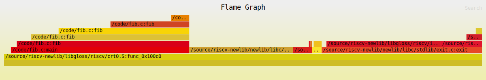

# Example fib

This project profiling data in the format expected by the flamegraph visualization tool.

# Gdb debugging

This article introduces debugging programs by using gdb.

For example, we want to know the parameters passed in to a function at runtime:

```sh
$ ckb-debugger --mode gdb --gdb-listen 127.0.0.1:9999 --bin fib
$ riscv64-unknown-elf-gdb fib

$ (gdb) target remote 127.0.0.1:9999
$ (gdb) b fib
$ (gdb) c
    Breakpoint 1, fib (n=5) at fib.c:2
```

At the Breakpoint 1, we learn that fib (n=5) at fib.c:2.


# Get flamegraph

We should take the `-g` option on compiling for saving the debugging information:

```sh
$ riscv64-unknown-elf-gcc -g -o fib fib.c
```

Save execution trace by:

```sh
$ ckb-debugger --bin fib --pprof fib.pprof
```

To convert the textual representation of a flamegraph to a visual one, first install inferno:

```sh
$ cargo install inferno
```

Then, pass the file created by ckb-debugger into inferno-flamegraph:

```sh
$ cat fib.pprof | inferno-flamegraph > fib.svg
```

Open the svg:


