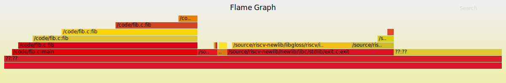

# Example fib

This project profiling data in the format expected by the flamegraph visualization tool.

# Usage

Suppose the program to be tested is:

```c
int fib(int n) {
    if (n == 0 || n == 1) {
        return n;
    } else {
        return fib(n-1) + fib(n-2);
    }
}

int main() {
    if (fib(10) != 55) {
        return 1;
    }
    return 0;
}
```

We should take the `-g` option on compiling for saving the debugging information:

```sh
$ riscv64-unknown-elf-gcc -g -o fib fib.c
```

Save execution trace by:

```sh
$ ckb-debugger --bin fib --pprof fib.pprof
```

To convert the textual representation of a flamegraph to a visual one, first install inferno:

```sh
$ cargo install inferno
```

Then, pass the file created by ckb-debugger into inferno-flamegraph:

```sh
$ cat fib.pprof | inferno-flamegraph > fib.svg
```

Open the svg:


